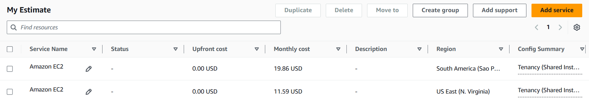
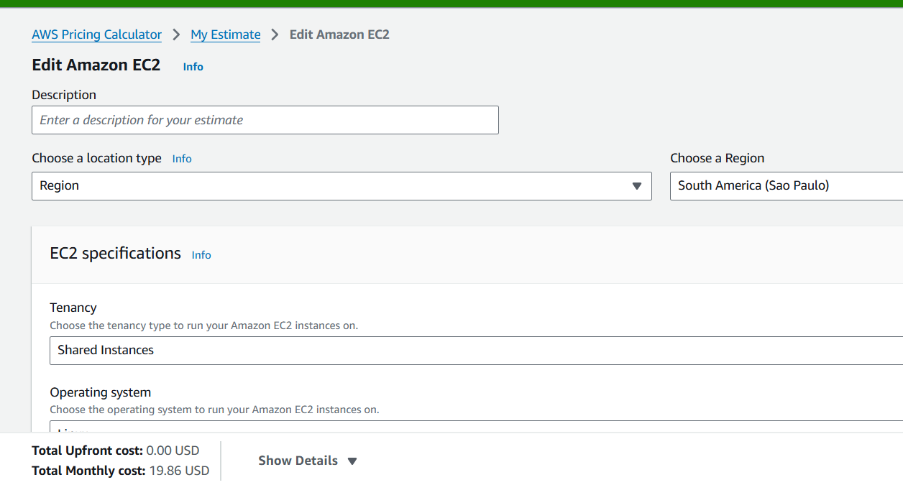
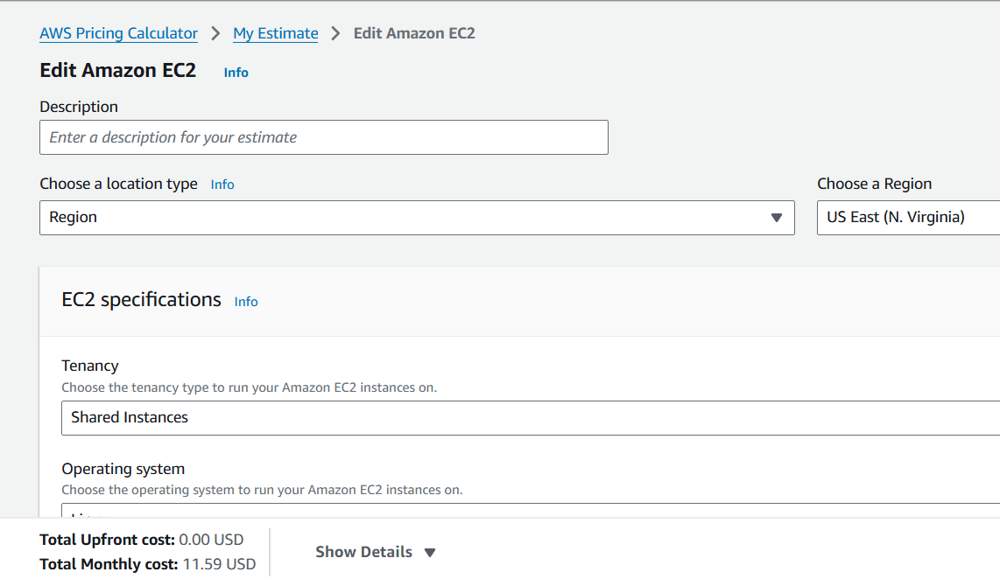

#  FarmTech Solutions – Análise de Rendimento de Safras

## Nome do grupo: Grupo 9

##  Integrantes: 
- <a href="https://www.linkedin.com/in/leon-gonzalez-8701b9199/">Pablo Leon Dimauro Gonzalez RM: 567944</a>

##  Professores:
### Tutor(a) 
- Ana Cristina Santos</a>
### Coordenador(a)
- <a href="https://www.linkedin.com/in/andregodoichiovato/">André Godoi</a>

### Descrição
Uma fazenda de médio porte produz quatro culturas: **Cacau, Óleo de Palma, Arroz e Borracha**. Foram coletados dados de **precipitação, temperatura, umidade específica, umidade relativa** e o respectivo **rendimento** (em toneladas/hectare). O desafio foi:

- Explorar os dados para entender padrões e relações;
- Aplicar **clusterização** para identificar tendências de produtividade e possíveis outliers;
- Desenvolver **cinco modelos preditivos** (regressão supervisionada) para estimar o rendimento das safras.

### Principais Descobertas
A **análise exploratória (EDA)** revelou que:
- A **cultura** é o fator dominante: **Óleo de Palma** (~175.000) tem produtividade muito superior às demais (**Arroz** ~32.000, **Cacau** e **Borracha** ~8.000–9.000).
- As **variáveis climáticas** são bastante homogêneas entre as culturas, com baixa variabilidade e correlações fracas com o rendimento.

### Clusterização (Não Supervisionado)
Utilizando **K-Means apenas com variáveis climáticas**, identificamos **6 clusters** com separação moderada (silhouette = 0,4457). Os clusters apresentaram **perfis de rendimento distintos**, sugerindo que, mesmo em condições climáticas similares, é possível agrupar observações com produtividades diferentes. O **DBSCAN** complementou a análise, detectando outliers que podem representar condições extremas ou erros de medição.

### Modelagem Preditiva (Supervisionado)
Foram treinados cinco modelos: **Regressão Linear, Árvore de Decisão, Random Forest, Gradient Boosting e SVR**.  
- **Com a variável cultura**, todos (exceto SVR) alcançaram **R² > 0,99** no teste, confirmando o poder preditivo da cultura.  
- **Apenas com variáveis climáticas**, os modelos tiveram desempenho **péssimo** (R² negativo ou próximo de zero).  
- **Clusters climáticos** também não agregaram poder preditivo, reforçando que a cultura é indispensável.

### Modelo Recomendado para Produção
A **Regressão Linear** foi escolhida como o melhor modelo por aliar:
- Alta performance (R² = 0,995, MAE ≈ 3132)
- Simplicidade e interpretabilidade (coeficientes claros)
- Baixo custo computacional para inferência

### Estrutura do Notebook
O notebook [PabloGonzalez_RM567944_fase5_cap1.ipynb](https://colab.research.google.com/drive/1yHbq1vXUE5YkjITE1lwy9bLj2OwHsdl_?usp=drive_link) contém todo o desenvolvimento, organizado em seções com:
- Código Python comentado e otimizado
- Visualizações e tabelas
- Células markdown com a descrição dos achados e conclusões

### Vídeo de Demonstração
[https://youtu.be/kgZfllw3g1A](https://youtu.be/kgZfllw3g1A) – vídeo com a explicação breve do projeto.

---
## ☁️ Entrega 2 – Estimativa de Custos AWS e Conformidade Legal

### Objetivo
Realizar uma estimativa de custos (On-Demand – 100%) para uma máquina Linux com as seguintes configurações:
- 2 CPUs
- 1 GiB de memória RAM
- Até 5 Gigabit de rede
- 50 GB de armazenamento (HD)

Comparar os valores para as regiões:
- **São Paulo (BR) – sa-east-1**
- **Virgínia do Norte (EUA) – us-east-1**

Analisar qual solução é mais barata e, considerando restrições legais de armazenamento no exterior (LGPD), escolher a opção mais adequada.

---

###  1. Configuração da Instância EC2 na AWS Pricing Calculator

**Passo a passo realizado:**
1. **Criação de uma nova estimativa**
2. **Seleção do serviço EC2**
3. **Configuração da instância:**
   - **Região:** testadas separadamente (sa-east-1 e us-east-1)
   - **Tenancy:** Compartilhada (Shared)
   - **Sistema Operacional:** Linux
   - **Número de instâncias:** 1
   - **Família da instância:** t3.micro (2 vCPU, 1 GiB RAM)
   - **Plano de pagamento:** On-Demand (730 horas/mês)
4. **Armazenamento:**
   - 1 volume EBS de 50 GB
   - Tipo: General Purpose SSD (gp3)
5. **Transferência de dados:**
   - Estimativa de 100 GB/mês de saída (tráfego da API)

---

---

###  3. Análise de Conformidade Legal (LGPD)

**Principais requisitos da LGPD:**
- Art. 33: A transferência internacional é permitida quando o país de destino oferece grau de proteção adequado ou quando o controlador oferece garantias de conformidade (cláusulas contratuais padrão, regras corporativas globais, etc.).
- O controlador deve demonstrar **accountability** – ou seja, que adota medidas para proteger os dados.

**Cenário da fazenda:**
- Os dados dos sensores podem ou não conter informações pessoais (depende do que é coletado).
- Mesmo sem dados pessoais, a empresa pode ter política interna de **soberania de dados** (manter dados no Brasil por decisão estratégica).

**Opções da AWS para conformidade:**
- A AWS oferece **Data Processing Agreement (DPA)** que atende aos requisitos da LGPD.
- O cliente pode escolher a região onde os dados serão armazenados.
- Ferramentas de criptografia e controle de acesso garantem proteção adicional.

---

### 4. Recomendação Final

Considerando os dois fatores – **custo** e **conformidade legal**:

| Critério | Análise |
|----------|---------|
| **Menor custo** | Virgínia do Norte (US$ 11.59/mês) |
| **Maior custo** | São Paulo (US$ 19.86/mês) |
| **Conformidade LGPD** | São Paulo elimina qualquer questionamento sobre transferência internacional |
| **Soberania de dados** | São Paulo atende a políticas internas de manter dados no Brasil |
| **Risco legal** | São Paulo = risco zero; Virgínia = necessidade de garantir conformidade contratual |

**Decisão final:**

> **Opção escolhida: Região São Paulo (sa-east-1)**  
> *Justificativa: Apesar do custo aproximadamente 42% superior (US$ 19.86  vs US$ 11.59), a escolha pela região brasileira garante que os dados permaneçam em território nacional, atendendo às exigências da LGPD e eliminando riscos legais associados à transferência internacional de dados. A diferença de US$ 10,27/mês é um investimento aceitável para segurança jurídica e conformidade.*

---

### Prints da Simulação

**Região São Paulo:**

**Região Virgínia do Norte:**

